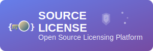

<div align="center">
  
</div>
[](https://github.com/PixelRidge-Softworks/Source-License/actions/workflows/codeql.yml)

# Source License - Professional Software Licensing Platform

> **IMPORTANT NOTE:** Source License is still in ***Alpha***. There **WILL** be issues, missing functionality, missing documentation, etc. Please let us know of any and all issues via a Issue!

## [View a Live Demo Here!](https://source-license.onrender.com/)
### [View Admin Dashboard Demo Here!](https://source-license.onrender.com/admin)

A comprehensive Ruby/Sinatra-based software licensing management system with integrated payment processing, secure API endpoints, and enterprise-grade features for software vendors.

## Overview

Source License is a complete solution for independent software vendors who need to sell, manage, and validate software licenses. Built with Ruby and Sinatra, it provides a robust platform for handling everything from product sales to license validation APIs that can be integrated into your software products.

## 🌟 Key Features

### 💰 Complete E-Commerce Solution
- **Product Management**: Create and manage software products with pricing, descriptions, and download files
- **Shopping Cart & Checkout**: Full e-commerce flow with cart functionality and secure checkout
- **Payment Processing**: Integrated Stripe and PayPal support with webhook handling
- **Order Management**: Complete order tracking and fulfillment system

### 🔐 Advanced License Management
- **Cryptographically Secure License Keys**: Multiple formats (XXXX-XXXX-XXXX-XXXX, UUID, custom)
- **Activation Control**: Limit installations per license with machine fingerprinting
- **License Types**: Support for perpetual, subscription, and trial licenses
- **License Operations**: Suspend, revoke, extend, transfer, and batch generate licenses
- **Validation API**: REST endpoints for real-time license verification in your software

### 👨‍💼 Comprehensive Admin Interface
- **Dashboard**: Real-time statistics and system overview
- **Product Management**: Create products with pricing, trial periods, and download files
- **License Administration**: Generate, manage, and monitor all licenses
- **Customer Management**: Track users, orders, and support requests
- **Order Processing**: View, manage, and fulfill customer orders
- **Reports & Analytics**: Detailed insights into sales and license usage

### 🎨 Customizable Frontend
- **Template System**: ERB templates with extensive helper functions
- **Live Customization**: Admin interface for colors, branding, and content
- **Responsive Design**: Bootstrap-based responsive layout
- **Multi-language Ready**: Template structure supports internationalization

### 🔒 Enterprise Security
- **JWT Authentication**: Secure API access with token-based auth
- **Admin Role Management**: Granular permissions and multi-admin support
- **Security Middleware**: CSRF protection, rate limiting, and security headers
- **Audit Logging**: Comprehensive logging of all license operations
- **Database Security**: Sequel ORM with prepared statements prevents SQL injection

### 🌐 REST API
- **License Validation**: Real-time license verification endpoints
- **License Activation**: Machine-based activation and deactivation
- **Order Processing**: Complete API for order creation and management
- **Webhook Support**: Stripe and PayPal webhook handling
- **Settings Management**: API for configuration management

### 📊 Subscription Management
- **Recurring Billing**: Automatic subscription renewals
- **Grace Periods**: Handle failed payments gracefully
- **Trial Management**: Free trial periods with automatic conversion
- **Billing History**: Complete payment and billing tracking

## 🚀 Quick Start

### Prerequisites
- **Ruby 3.4.4** or higher
- **Database**: MySQL, PostgreSQL, or SQLite (SQLite should ***not*** be used in production!!!)
- **Git** for cloning the repository

### Installation

1. **Clone the repository**
   ```bash
   git clone https://github.com/PixelRidge-Softworks/Source-License.git
   cd Source-License
   ```

2. **Run the Install Script for your platform**
   ```bash
   .\install.ps1 (for windows)
   ./install.sh (for linux/macos)
   ```

3. **Run the deployment script for your platform**
   ```bash
   .\deploy.ps1 (for windows)
   ./deploy.sh (for linux/macos)
   
   The launcher will automatically:
   - ✅ Verify Ruby version compatibility
   - 📦 Install required gems via Bundler
   - 🗄️ Set up and migrate the database
   - ⚙️ Create configuration files from templates
   - 🚀 Launch the application server

3. **Access the application**
   - **Main Website**: http://localhost:4567
   - **Admin Panel**: http://localhost:4567/admin
   - **License Lookup**: http://localhost:4567/my-licenses

### Initial Configuration

The launcher creates a `.env` file from the template. Configure these essential settings:

```env
# Application Settings
APP_ENV=development
APP_SECRET=your_secret_key_here_change_this_in_production
APP_HOST=localhost
APP_PORT=4567

# Security Settings
JWT_SECRET=your_jwt_secret_here_change_in_production
SECURITY_WEBHOOK_URL=https://your-security-monitoring-service.com/webhook

# Production Configuration
APP_VERSION=1.0.0
ALLOWED_ORIGINS=https://yourdomain.com,https://www.yourdomain.com

# Logging & Monitoring
LOG_LEVEL=info
LOG_FORMAT=json
ERROR_TRACKING_DSN=https://your-sentry-dsn@sentry.io/project

# Performance & Caching
REDIS_URL=redis://localhost:6379/0
ENABLE_CACHING=true
CACHE_TTL=3600

# SSL/TLS Configuration
FORCE_SSL=true
HSTS_MAX_AGE=31536000

# Database Connection Pool
DB_POOL_SIZE=10
DB_TIMEOUT=5000

# Rate Limiting
RATE_LIMIT_REQUESTS_PER_HOUR=1000
RATE_LIMIT_ADMIN_REQUESTS_PER_HOUR=100

# Session Configuration
SESSION_TIMEOUT=28800
SESSION_ROTATION_INTERVAL=7200

# Database Configuration
# Choose one: mysql, postgresql, or sqlite

# Option 1: MySQL (requires MySQL server)
DATABASE_ADAPTER=mysql
DATABASE_HOST=localhost
DATABASE_PORT=3306
DATABASE_NAME=source_license
DATABASE_USER=root
DATABASE_PASSWORD=your_password

# Option 2: PostgreSQL (requires PostgreSQL server)
# DATABASE_ADAPTER=postgresql
# DATABASE_HOST=localhost
# DATABASE_PORT=5432
# DATABASE_NAME=source_license
# DATABASE_USER=postgres
# DATABASE_PASSWORD=your_password

# Option 3: SQLite (ONLY for development - no server required)
# DATABASE_ADAPTER=sqlite
# DATABASE_NAME=source_license.db

# Admin Settings
ADMIN_EMAIL=admin@yourdomain.com
ADMIN_PASSWORD=change_this_secure_password

# Payment Gateway Settings
# Stripe
STRIPE_PUBLISHABLE_KEY=pk_test_your_stripe_publishable_key
STRIPE_SECRET_KEY=sk_test_your_stripe_secret_key
STRIPE_WEBHOOK_SECRET=whsec_your_webhook_secret

# PayPal
PAYPAL_CLIENT_ID=your_paypal_client_id
PAYPAL_CLIENT_SECRET=your_paypal_client_secret
PAYPAL_ENVIRONMENT=sandbox

# Email Configuration (for license delivery)
SMTP_HOST=smtp.gmail.com
SMTP_PORT=587
SMTP_USERNAME=your_email@gmail.com
SMTP_PASSWORD=your_app_password
SMTP_TLS=true

# License Settings
# THESE SETTINGS ARE DEPRECATED
LICENSE_VALIDITY_DAYS=365
MAX_ACTIVATIONS_PER_LICENSE=3

# File Storage
DOWNLOADS_PATH=./downloads
LICENSES_PATH=./licenses
```

## 📁 Project Architecture

### Directory Structure

```
Source-License/
├── app.rb                    # Main application entry point
├── config.ru                # Rack configuration for deployment
├── launch.rb                # Cross-platform launcher script
├── Gemfile                  # Ruby dependencies
├── .env.example            # Environment configuration template
│
├── lib/                    # Core application logic
│   ├── models.rb           # Database models (User, Product, License, Order, etc.)
│   ├── license_generator.rb # License creation and management
│   ├── payment_processor.rb # Stripe/PayPal integration
│   ├── database.rb         # Database configuration and migrations
│   ├── auth.rb             # Authentication helpers
│   ├── security.rb         # Security middleware and utilities
│   ├── helpers.rb          # Template helpers and utilities
│   ├── customization.rb    # Theme and branding management
│   ├── settings_manager.rb # Configuration management
│   └── controllers/        # Modular controller architecture
│       ├── public_controller.rb    # Public website routes
│       ├── admin_controller.rb     # Admin interface routes
│       ├── api_controller.rb       # REST API endpoints
│       └── admin/               # Admin sub-controllers
│
├── views/                  # ERB template files
│   ├── layouts/           # Layout templates
│   ├── partials/          # Reusable components
│   ├── admin/             # Admin interface templates
│   ├── users/             # User account templates
│   ├── licenses/          # License management templates
│   └── errors/            # Error page templates
│
├── test/                   # Comprehensive test suite
│   ├── app_test.rb        # Application integration tests
│   ├── models_test.rb     # Database model tests
│   ├── auth_test.rb       # Authentication tests
│   └── factories.rb       # Test data factories
│
├── config/                # Configuration files
├── downloads/             # Product download files (auto-created)
└── public/                # Static assets (auto-created)
```

### Database Models

**Core Models:**
- `User` - Customer accounts with license management
- `Admin` - Administrative users with role-based permissions  
- `Product` - Software products for sale with pricing and configuration
- `Order` - Customer purchases with payment tracking
- `OrderItem` - Individual items within orders
- `License` - Generated software licenses with activation tracking
- `LicenseActivation` - Machine-specific activation records
- `Subscription` - Recurring billing for subscription products

### Controller Architecture

The application uses a modular controller architecture:

- **PublicController**: Homepage, product pages, cart, checkout
- **AdminController**: Admin dashboard, settings, management interfaces
- **ApiController**: REST API endpoints for license validation and management
- **UserAuthController**: User registration, login, password reset
- **Admin Namespace**: Specialized admin controllers for products, licenses, features

## 🔧 Configuration

### Database Options

**SQLite (ONLY for Development)**
```env
DATABASE_ADAPTER=sqlite
DATABASE_NAME=source_license.db
```

**MySQL**
```env
DATABASE_ADAPTER=mysql
DATABASE_HOST=localhost
DATABASE_PORT=3306
DATABASE_NAME=source_license
DATABASE_USER=your_user
DATABASE_PASSWORD=your_password
```

**PostgreSQL**
```env
DATABASE_ADAPTER=postgresql
DATABASE_HOST=localhost
DATABASE_PORT=5432
DATABASE_NAME=source_license
DATABASE_USER=postgres
DATABASE_PASSWORD=your_password
```

### Payment Gateway Setup

**Stripe Configuration**
1. Create account at [stripe.com](https://stripe.com)
2. Get API keys from dashboard
3. Configure webhook endpoint: `your-domain.com/api/webhook/stripe`

**PayPal Configuration**
1. Create developer account at [developer.paypal.com](https://developer.paypal.com)
2. Create application for API credentials
3. Set environment (sandbox/production)

### Email Configuration

Supports SMTP for license delivery and notifications:

```env
SMTP_HOST=smtp.gmail.com
SMTP_PORT=587
SMTP_USERNAME=your_email@gmail.com
SMTP_PASSWORD=your_app_password
SMTP_TLS=true
```

## 🔌 API Reference

### Authentication

Obtain JWT token for API access:

```bash
curl -X POST http://localhost:4567/api/auth \
  -H "Content-Type: application/json" \
  -d '{"email": "admin@example.com", "password": "password"}'
```

### License Validation

Validate a license key:

```bash
curl -X GET http://localhost:4567/api/license/XXXX-XXXX-XXXX-XXXX/validate
```

Response:
```json
{
  "valid": true,
  "status": "active",
  "product": "My Software",
  "expires_at": "2025-12-31T23:59:59Z",
  "activations_used": 1,
  "max_activations": 3
}
```

### License Activation

Activate license on a machine:

```bash
curl -X POST http://localhost:4567/api/license/XXXX-XXXX-XXXX-XXXX/activate \
  -H "Content-Type: application/json" \
  -d '{"machine_fingerprint": "unique_machine_id"}'
```

### Complete API Endpoints

| Method | Endpoint | Description |
|--------|----------|-------------|
| POST | `/api/auth` | Authenticate and get JWT token |
| GET | `/api/products` | List active products |
| POST | `/api/orders` | Create new order |
| GET | `/api/orders/:id` | Get order details |
| POST | `/api/orders/free` | Process free orders |
| GET | `/api/license/:key/validate` | Validate license key |
| POST | `/api/license/:key/activate` | Activate license |
| POST | `/api/webhook/:provider` | Payment webhooks |
| GET | `/api/settings/:category` | Get configuration settings |
| PUT | `/api/settings/:category/:key` | Update setting |

## 🎨 Customization

### Template Customization

The application includes a powerful customization system accessible via the admin panel:

- **Branding**: Site name, logo, colors, fonts
- **Content**: Homepage text, product descriptions, legal pages
- **Layout**: Template structure and styling
- **Themes**: Pre-built color schemes and layouts

### Helper Functions

Templates include extensive helper functions:

```erb
<!-- Currency formatting -->
<%= format_currency(29.99) %> <!-- Output: $29.99 -->

<!-- Date formatting -->
<%= format_date(Time.now, :long) %> <!-- Output: January 19, 2025 -->

<!-- Status badges -->
<%= status_badge('active') %> <!-- Output: <span class="badge badge-success">Active</span> -->

<!-- Custom buttons -->
<%= button 'Buy Now', class: 'btn btn-primary btn-lg' %>

<!-- Cards with styling -->
<%= card 'Product Info', class: 'border-primary' do %>
  <p>Product details here...</p>
<% end %>
```

### Development Customization

For developers, templates can be directly modified:

- **Layouts**: `views/layouts/main_layout.erb`, `views/layouts/admin_layout.erb`
- **Partials**: `views/partials/_navigation.erb`, `views/partials/_footer.erb`
- **Styles**: Customize CSS via admin panel or edit templates directly

## 🚀 Deployment

### Development

```bash
ruby launch.rb
```

### Production

1. **Edit .env**

2. **Run Install Script**
   ```bash
   .\install.ps1 (windows)
   ./install.sh (linux/macos)
   ```

3. **Run deployment script**
   ```bash
   .\deploy.ps1 (windows)
   ./deploy.sh (linux/macos)
   ```
   
## 🧪 Testing

### Test suite has yet to be implemented

### Recommended Production Settings

```env
APP_ENV=production
FORCE_SSL=true
HSTS_MAX_AGE=31536000
SESSION_TIMEOUT=28800
RATE_LIMIT_REQUESTS_PER_HOUR=1000
```

## 🛠️ Development

### Setting Up Development Environment

1. **Install dependencies**
   ```bash
   bundle install
   ```
   
2. **Start development server**
   ```bash
   ruby launch.rb
   ```

### Code Quality

The project includes comprehensive code quality tools:

- **RuboCop**: Ruby style guide enforcement
- **RuboCop Extensions**: Minitest, Performance, Sequel specific rules
- **Test Coverage**: SimpleCov with console reporting

```bash
# Run style checks
bundle exec rubocop

# Auto-fix style issues
bundle exec rubocop -A
```

## 📖 Use Cases

### Software Vendors
- Sell desktop applications with license management
- Distribute plugins and extensions with activation limits
- Manage trial periods and subscription renewals
- Track usage analytics and license compliance

### SaaS Applications
- License validation for client-side applications
- Machine-based activation for offline software
- Subscription management with automatic renewals
- Multi-tier licensing with different activation limits

### Educational Software
- Student/teacher license management
- Institution-wide licensing
- Temporary access and trial periods
- Bulk license generation for schools

## 🤝 Contributing

1. Fork the repository
2. Create a feature branch (`git checkout -b feature/amazing-feature`)
3. Check code style (`bundle exec rubocop`)
4. Commit your changes (`git commit -m 'Add amazing feature'`)
5. Push to the branch (`git push origin feature/amazing-feature`)
6. Open a Pull Request

## 📄 License

This project is licensed under the GNU General Public License v2.0 - see the [LICENSE](LICENSE) file for details.

## 🆘 Support

- **Issues**: [GitHub Issues](https://github.com/PixelRidge-Softworks/Source-License/issues)
- **Documentation**: [Project Wiki](https://github.com/PixelRidge-Softworks/Source-License/wiki)
- **Discussions**: [GitHub Discussions](https://github.com/PixelRidge-Softworks/Source-License/discussions)

## 📈 Roadmap

### Current Version (v1.0-ALPHA)
- ✅ Complete license management system
- ✅ Stripe and PayPal integration
- ✅ REST API with JWT authentication
- ✅ Admin dashboard and user management
- ✅ Cross-platform launcher
- ✅ Multiple database support

### Future Enhancements
- 🔄 Advanced analytics and reporting
- 🌐 Multi-language support
- 📱 Mobile-responsive admin interface
- 🔧 Plugin system for extensions
- 📊 Advanced subscription management
- 🌍 International payment methods

---

**Built with ❤️ using Ruby and Sinatra by the PixelRidge Softworks team**

*Source License - Empowering software vendors with professional licensing solutions*
